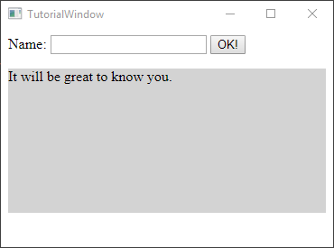

# Tutorial

## Quick Start

### Objective

A simple HTML window with textbox button and etc.

### Step 1: A basic Window

Craft a simple HTML with a textbox with a label, a submit button, and a paragraph element for showing results.

**TutorialWindow.html**:

```html
<html>
<body>

    <!-- A textbox to enter name -->
    <label>
        Name: <input id="textbox-name" type="text">
    </label>
    
    <!--A submit button-->
    <button id="button-ok">OK!</button>

    <!--A text area for results-->
    <p style="background-color: lightgray; height: 10em">
        <span id="result">It will be great to know you.</span>
    </p>
    
</body>
</html>
```

You can see the preview with your fav browser:


Next, we create a TutorialWindow class for this window. Create a `TutorialWindow.py` at the same level with 
the `TutorialWindow.html`.

> Notes:

> There are many ways to load HTML content for a window. By default, the `Window` tries to 
> locate a same class name `.html` next to the class file. You can override the `.page_uri(self)` 
> and return the html uri. You can also return html string like: `Window.html_to_data_uri(html_string)` 
> For more detail about `.page_uri(self)`, see the API documentation. 

**TutorialWindow.py**:

```python
class TutorialWindow(puithon.Window):
    def on_before_close(self):
        RuntimeManager.get_instance().shutdown()
```

We have nothing yet but override the method `.on_before_close()` to exit the PuiTHON event loop when the window 
is closing.

#### Run the whole thing

Initialize the window object and start the PuiTHON event loop.

**TutorialWindow.py**:

```python
if __name__ == '__main__':

    # Initialize the window object
    window = TutorialWindow()
    
    # Show the window
    puithon.RuntimeManager.get_instance().WindowManager.window_show(window)
    
    # Start the PuiTHON event loop
    puithon.RuntimeManager.get_instance().start()
```

and run `python TutorialWindow.py`, you should see:



### Step 2: Wire some actions for the view

todo
